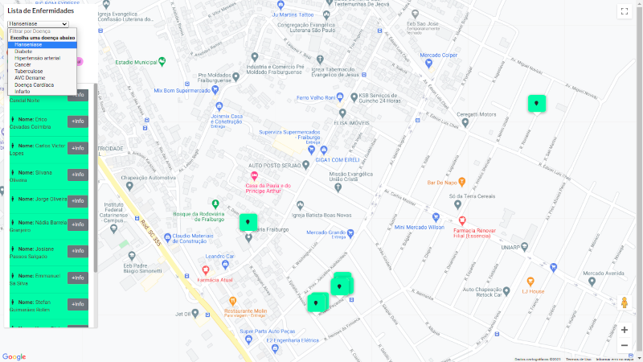

# Mapeamento de Doenças Crônicas
  
> Mapeamento de doenças crônicas utilizando dados de saúde em JSON no formato eSUS. Ao importar o arquivo no SGBD é realizado o mapeamento com o marcador colorido relacionado a doença. 
### Screenshot do projeto
 

### Mapa do Projeto


## Instalação & Configuração do Projeto

### 1ª etapa - Configuração
> Configure os dados das credencias para acesso ao SGBD Firebase no arquivo [main.js](src/main.js)


### 2ª etapa - Instalação

``` bash
# Instale as dependências
npm install

# Rode o projeto em localhost:8080 em modo desenvolvimento
npm run dev

# construir para produção com minimização
npm run build

```

### Onde esse trabalho foi apresentado ?
  