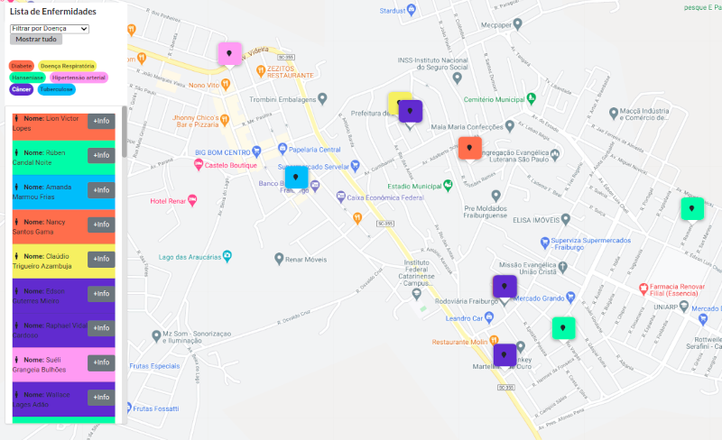
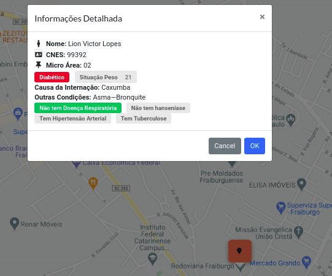
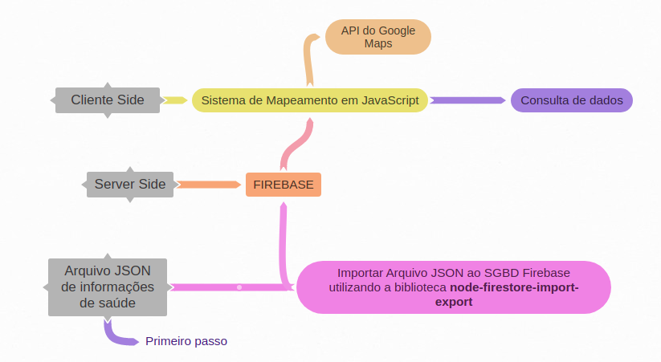

# Mapeamento de Doenças Crônicas
  
> Mapeamento de doenças crônicas utilizando dados de saúde em JSON no formato eSUS. Ao importar o arquivo no SGBD é realizado o mapeamento com o marcador colorido relacionado a doença. 
### Screenshot do projeto
> As informações apresentadas são **DADOS FICTÍCIOS DE SAÚDE**.

 
### Estrutura do Projeto



## Instalação & Configuração do Projeto

### 1ª etapa - Configuração
> Configure os dados das credencias para acesso ao SGBD Firebase no arquivo [main.js](src/main.js)


### 2ª etapa - Instalação

``` bash
# Instale as dependências
npm install

# Rode o projeto em localhost:8080 em modo desenvolvimento
npm run dev

# construir para produção com minimização
npm run build

```
### 3ª Incluir informações ao Mapa
> Para incluir novas informações ao mapa é necessário incluir o arquivo com as informações de saúde em [JSON](src/assets/dadosSaude/98693.json) ao SGBD Firebase. A biblioteca utilizada para realizar essa importação é o node-firestore-import-export, consulte a documentação [clicando aqui](https://www.npmjs.com/package/node-firestore-import-export). 
### Onde esse trabalho foi apresentado ?
  
### Autores e integrantes do projeto
1. Leonardo Venâncio Teixeira. [Acessar Lattes](http://lattes.cnpq.br/0437092313796879) ou [Acessar Linkedln](https://www.linkedin.com/in/leonardo-teixeira-110130105/)
2. Prof. Luiz Leandro dos Reis Fortaleza [Acessar Lattes](http://lattes.cnpq.br/0374659622170312)
3. Prof. Marlon Cordeiro Domenech [Acessar Lattes](http://lattes.cnpq.br/8493837577432710)